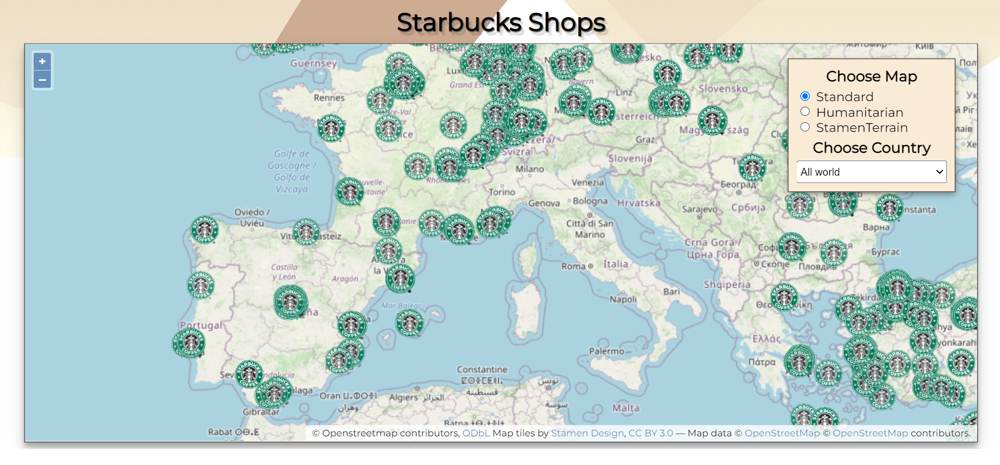

# Starbucks Shops App 🌟

---

## In this project I created a web page that shows a map of all the Starbucks shops in the world.

## The map is displayed by [Open Layers](https://openlayers.org/).

---

## App Description 📝

### On the right side of the map there is a selection box, which contains 2 options:

- #### Select a map -   User can choose which map will be displayed (3 options)

- #### Names of all the countries in the world that have Starbucks shops -   When the user selects a country, the view of the map moves to the country, and shows only the Starbucks shops of the country.   In addition,the area of ​​the country is highlighted.

---

## Information on Starbucks shops and state territory 📚

- ### The information about all the Starbucks shops in the world I get from this [API](https://raw.githubusercontent.com/mmcloughlin/starbucks/master/locations.json).   (The list is updated so I request the information each time the page is loaded)

- ### The information about the territory of the countries in the world I get from this [API](https://openlayers.org/en/v4.6.5/examples/data/geojson/countries.geojson). (geographical coordinates of the countries)

---

## The App 📱

### Global use - 🌎

- ### Test the [App](https://62a9d0798e3ae7173452d5df--clinquant-lebkuchen-f40bfd.netlify.app/) ✨

- ### The app deploy on [Netlify](https://www.netlify.com/).

### Local use - 📌

- ### Clone the repo - https://github.com/yakovcohen4/starbucks-openlayers

- ### Open terminal and switch to `starbucks-project` folder by running `cd .\starbucks-project\`
- ### Run `npm i` to install all the dependencies
- ### Run `npm run dev` to start the app (The app is running on localhost:3000)
